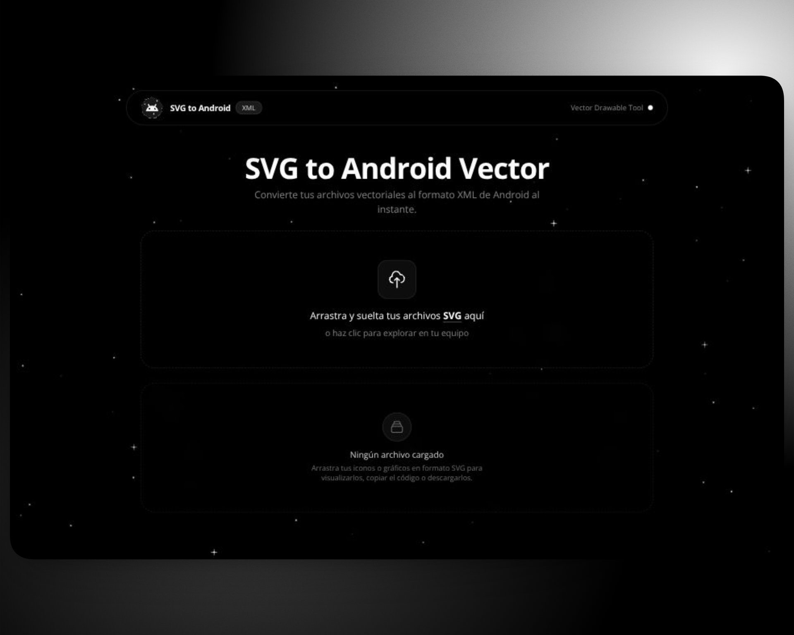

<h1 align="center">🚀 SVG to Android Vector</h1>

<p align="center">
  
</p>

<p align="center">
  <a href="https://svg-to-android.vercel.app" target="_blank" rel="noopener noreferrer">
    
  </a>
</p>

<p align="center">
  <a href="https://astro.build" target="_blank" rel="noopener noreferrer">
    
  </a>
  <a href="https://www.typescriptlang.org" target="_blank" rel="noopener noreferrer">
    
  </a>
  <a href="https://tailwindcss.com" target="_blank" rel="noopener noreferrer">
    
  </a>
  <a href="https://developer.android.com/jetpack/compose" target="_blank" rel="noopener noreferrer">
    
  </a>
</p>

<p align="center">
  <a href="LICENSE">
    
  </a>
  <a href="https://pnpm.io" target="_blank" rel="noopener noreferrer">
    
  </a>
  
</p>

---

## 📌 Overview

**SVG to Android Vector** is a modern, ultra-fast, and minimalist web tool built with **Astro** and **vanilla TypeScript**, designed to convert SVG files into **Android Vector Drawable (`.xml`)** directly in the browser.

Optimized for native Android development (traditional XML Drawables) and **Jetpack Compose**, it produces clean, ready-to-use XML code starting with the standard `<?xml version="1.0" encoding="utf-8"?>` declaration and without any unnecessary comments, ready to copy and paste straight into your `res/drawable/` directory.

---

## ✨ Key Features

- **Zero Heavy UI Frameworks:** Built with native TypeScript and Astro (no React overhead, instant rendering, minimal client bundle).
- **100% Client-Side Processing:** Your vector assets are processed strictly in your browser. Complete privacy, zero external server uploads, and offline capability.
- **Behind-the-Scenes 4-Layer Security:**
  - Browser-level input restriction (`accept=".svg,image/svg+xml"`).
  - File extension and MIME type verification.
  - Strict XML validation using `DOMParser`.
  - Deep sanitization stripping executable scripts, `<iframe>`, `onload`/`onclick` events, and `javascript:` URIs.
- **Interactive Preview with Deep Zoom:** Click any icon preview to open a detailed modal with zoom controls (`+`, `-`, mouse wheel, and 100% reset).
- **1-Click XML Copy:** Instant copy of the clean Android Vector XML to your clipboard.
- **Individual & Batch ZIP Downloads:** Download individual XML files formatted with valid Android resource naming (`ic_name.xml`) or package all converted assets into a single `.zip` file.
- **1-Click Quick Discard:** Remove items immediately if you only need to copy and paste the code.
- **Minimalist Space Aesthetic:** Procedural 60fps canvas starfield with subtle 2px twinkling dots, pure black `#000000` theme with rounded borders, and an auto-hiding floating navigation bar on scroll.

---

## 🏛️ Clean Architecture & SOLID Principles

The project strictly decouples presentation, domain models, and infrastructure adapters:

```text
src/
├── domain/                      # Core business models, entities, and ports
│   ├── entities/                # SvgFile, VectorDrawable
│   ├── errors/                  # SvgValidationError
│   └── ports/                   # Interfaces (ISvgValidator, ISvgConverter, IZipExporter...)
│
├── application/                 # Use cases (Orchestration)
│   ├── dtos/                    # ProcessedItemDto
│   └── use-cases/               # ProcessSingleSvgFile, ExportAllAsZip, CopyXmlToClipboard...
│
├── infrastructure/              # Concrete implementations & browser adapters
│   ├── security/                # StrictSvgValidator, SvgSanitizer
│   ├── converter/               # SvgToAndroidConverter, ColorUtils
│   │   └── node-transformers/   # PathTransformer, BasicShapesTransformer, GroupTransformer
│   └── services/                # BrowserZipExporter, BrowserClipboardService, BrowserDownloadService
│
└── presentation/                # Presentation Layer (MVP Pattern)
    ├── components/              # Header, Dropzone, GlobalActions, PreviewModal, Toast, SpaceBackground
    ├── presenters/              # ConverterAppPresenter, AppBootstrap
    ├── state/                   # AppStateStore (Reactive Pub-Sub Store)
    └── styles/                  # global.css (Tailwind CSS)
```

### Applied SOLID Principles:
- **S (Single Responsibility):** Each validator, transformer, and presenter has a single, well-defined task.
- **O (Open/Closed):** New SVG element support can be added by implementing `INodeTransformer` without modifying core converter logic.
- **L (Liskov Substitution):** Port implementations (`ISvgValidator`, `ISvgConverter`) can be swapped seamlessly.
- **I (Interface Segregation):** Granular, targeted interfaces rather than monolithic services.
- **D (Dependency Inversion):** Use cases depend solely on domain interfaces, never on DOM or browser APIs directly.

---

## 🛠️ Local Development & Setup

This repository uses **pnpm** as its package manager.

```bash
# 1. Clone the repository
git clone https://github.com/BR444N/SvgToAndroid.git
cd SvgToAndroid

# 2. Install dependencies with pnpm
pnpm install

# 3. Start local development server
pnpm dev

# 4. Run automated unit tests
pnpm test

# 5. Build for production
pnpm build

# 6. Preview production build
pnpm preview
```

---

## 🧪 Automated Unit Tests

Unit tests are included to verify:
- Android resource filename sanitization (`ic_name.xml`).
- CSS/SVG color normalization to Android hex (`#AARRGGBB`).
- Basic geometric shape conversion (`<rect>`, `<circle>`, `<polygon>`, etc.) into `<path>` data.

Run the test suite:
```bash
pnpm test
```

---

## 📄 License

This project is licensed under the **MIT License**. See the [LICENSE](LICENSE) file for details.
